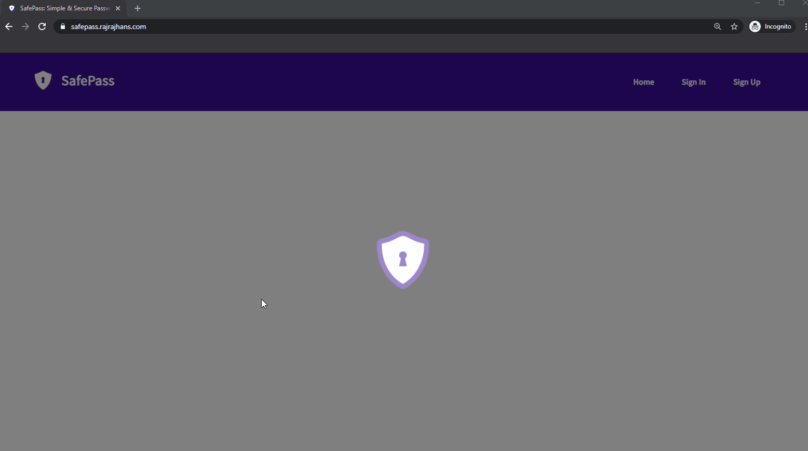

<p align="center">
  <a href="https://safepass.rajrajhans.com">
    
  </a>
</p>

<h1 align="center">
  <a href="https://safepass.rajrajhans.com" target="_blank">
    SafePass
  </a>
</h1>

<h4 align="center">
  Simple and Secure Password Management 
</h4>

SafePass is a simple password management tool developed using ReactJS and Firebase. It is live and accessible [here](https://safepass.rajrajhans.com). 

I am also working on developing an Android Client for SafePass using React Native. Check out [this repo](https://github.com/rajrajhans/safepass-android) for the Android app.

### Screenshots

Following is a sneak peek of how the interface looks.



### Running the project locally

1. Create a new Firebase project and add a new "Web App" to it. Follow the [steps given here](https://firebase.google.com/docs/web/setup) until you get the "Firebase Config Object".
2. Create a file `src/config.js` and paste your config object in it.
3. In the same file, create a variable named "key" and paste a random string. This will be used for encryption, so make sure it is strong.
4. Below is an example of the code in `src/config.js` for your reference - 
```javascript
export const key = 'RANDOM_STRING_HERE';
export const firebaseConfig = {
  apiKey: 'YOUR_FIREBASE_API_KEY',
  authDomain: 'YOUR_FIREBASE_AUTH_DOMAIN',
  databaseURL: 'YOUR_FIREBASE_DB_URL',
  projectId: 'YOUR_FIREBASE_PROJECTID',
  storageBucket: 'YOUR_FIREBASE_STORAGE_BUCKET',
  messagingSenderId: 'YOUR_FIREBASE_SENDER_ID',
  appId: 'YOUR_FIREBASE_APP_ID',
};
```
5. Once this is done, run `npm install` to install all dependencies
6. Finally, run `npm start` to run the app in development mode. 
